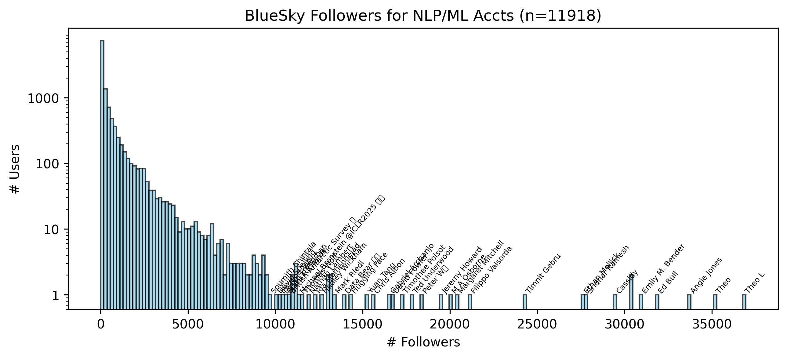

### BlueSky Public API Demo

Demo script for pulling data with the BlueSky Public API. Uses [atproto](https://github.com/MarshalX/atproto), a third-party library to interact with atproto. 

Here's an example of follower counts for NLP/ML accounts (*"NLP/ML" as classified by 4.1-mini*), rendered in [analysis.ipynb](./analysis.ipynb):

<p align="center">
  
</p>

*Note, the [private API](https://docs.bsky.app/docs/advanced-guides/rate-limits) has rate limits (3000 per 5 minutes across API), but the public API is quite generous.*

### Setup

```sh
pip install atproto tqdm matplotlib ipykernel openai

python network.py
```